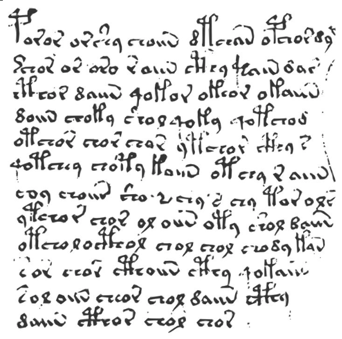

# Voynich Brute Forcer

## Motivation

The [Voynich Manuscript (VMS)](https://en.wikipedia.org/wiki/Voynich_manuscript) is a centuries-old linguistic
enigma characterised by a unique statistical profile. It appears incompatible with simple substitution ciphers of
natural language, but yet retains many characteristics of meaningful, semantic text.

This project attempts an evolutionary approach. I proceed from the assumption that the text was generated
by a specific set of rules applied to a source text by a human operator in the 15th century.
The aim is to provide statistical insight on what family of methods produce texts most similar to the VMS.

## Implementation

I employ [linear genetic programming](https://en.wikipedia.org/wiki/Linear_genetic_programming) to evolve pipelines of
text modifiers and text sources.

By modifiers, I mean ways the VMS authors could have changed their plaintext. Examples include classic ciphers known
since antiquity to more obscure methods like homophonic substitutions. By text sources, I mean different categories of
plaintext:

- Examples of VMS-contemporary texts in German, French, Italian etc.
- Examples of asemic/random writing

These candidate pipelines are tested against the manuscript's known statistical anomalies, such as its adherence to
Zipf’s Law, its unusually low conditional character entropy, and its rigid word-length distribution. I attempt to
maintain historical plausibility by assigning a cognitive complexity score to each method, penalising algorithms that
would be too mentally taxing for a medieval scribe to perform fluently.

I calculate the deviation of the statistical output from a given combination of methods to the values empirically
witnessed in the VMS. Put simply, if we find that such-and-such sets of methods consistently lead to similar statistical
profiles, it hints at the techniques used by the original authors.

### Terminology

I initially called this approach a 'genetic algorithm'. But I have since learned that this is inappropriate for the
particular approach I am taking, because my genomes are not fixed-length. This is because some of my text modification
methods alter the length of the original text (such as deleting vowels or duplicating letters).

As such, this app is best characterised as linear genetic programming. But some of the terminology used in the code is
likely non-standard.

## Status

This project is a work in progress. I'm not intimately familiar with cryptography, genetic programming or statistics.

I make no claim that this program can produce scientifically meaningful evidence right now. Its primary use is being an
educational tool for myself. But it's my hope it can one day be a useful tool for those wishing to check the
plausability of certain methods ('could this have produced a text like the VMS?').

## Assumptions and limitations

Because the Voynich is so singular, any attempt to explain it will inevitably rest on various assumptions about its
nature. These assumptions are probably a large factor in why it has resisted analysis for so long, but we cannot work
without assumptions: the best we can do is state them clearly, instead of leaving them implicit. So the following are
mine.

- **An effective method.**  
  The VMS was produced by [an effective method](https://en.wikipedia.org/wiki/Effective_method). That is, the original
  creator began with a plaintext and, through some process—iterative or otherwise, simple or complex—applied various
  transformations to produce the Voynichese text.
    - I consider this a highly justified assumption.
    - The Voynich exists: someone, in 15th-century Europe, sat down and composed it. There must have been a way they did
      it.
    - The statistical profile of the VMS is too striking to plausibly arise from off-the-cuff, free-flow writing for a
      text of its length and internal consistency. (This does *not* assume the source text was not asemic.)
    - In short, the strange statistical elements of the VMS are assumed to be the result of an effective method, not
      improvisation.

- **Statistical proximity implies historical relevance.**  
  An effective method which produces ciphertexts that strongly follow the statistical profile of the VMS is more likely
  to be related to the actual historical method than one which produces ciphertexts with wildly diverging statistics.

- **Constructive rather than obscurative processes.**  
  The historical method was likely constructive or destructive in nature—adding structure—rather than merely
  transforming
  existing structure.
    - I believe this because the text exhibits levels of character entropy different to those seen in both natural
      language and purely random texts.

- **Unequal importance of statistical features.**  
  Some statistical elements matter more than others. In particular, the VMS’s remarkably low H₂ entropy is a defining
  feature that rules out simple substitution ciphers of natural language. Any candidate method must reproduce this
  property, whereas other features are given lesser weight by the evolutionary algorithm.

- **Search-space reducibility.**  
  The space of plausible methods can be meaningfully narrowed using genetic and evolutionary processes. I think this
  assumption is highly warranted.

- **Coverage of historical techniques.**  
  The elementary steps implemented in this system contain functional equivalents of those plausibly used by the
  historical VMS creators. If they employed techniques entirely outside this space, they will not be discovered. While
  the exact physical mechanism (e.g. a specific Cardan grille) may not be replicated, the underlying mathematical
  transformation is assumed to be represented. This is a very plausible flaw with the application.

- **Methodological consistency.**  
  The method used to produce the VMS was consistent across its composition. If fundamentally different methods were used
  in different sections, this approach—aimed at matching a composite statistical profile—will fail. In principle, this
  could be mitigated by analysing smaller textual segments independently.

- **Cognitive economy.**  
  The creators of the VMS were constrained by cognitive complexity and did not choose arbitrarily complex methods when
  simpler ones achieved the same result. (Indeed, we can assume that even if they wanted to, there was a psychological
  limit to how much complexity their method could involve before regularly making mistakes, which we do not witness in
  the text itself). Accordingly, unnecessary complexity is penalised by the genetic algorithm.

- **Transliteration reliability.**  
  Existing transliterations of the Voynich are broadly accurate. A fundamentally incorrect transliteration scheme would
  yield a different statistical profile (e.g. character entropy), rendering this approach incoherent.

### Non-assumptions

- I do not assume the source text for the VMS carried semantic meaning. It may have been asemic writing or a composite
  of unrelated texts. Whatever method the original authors used is assumed to impose the VMS’s distinctive statistical
  profile regardless of the meaningfulness of the source material.
- As a consequence, I hold no particular assumptions about the source text being in any particular natural language. If
  the program doesn't test for a given language (e.g. Chinese, Mongolian), it's purely due to a lack of effort on my
  part, not a predisposition against those options.

### License

MIT license. Contributions are welcome.